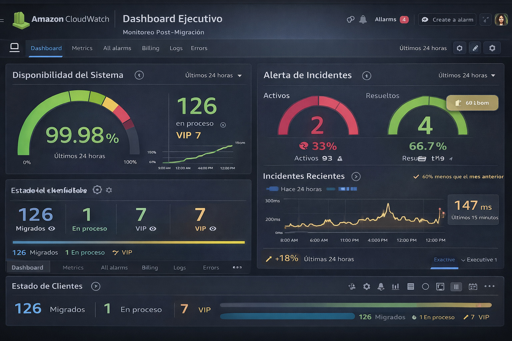
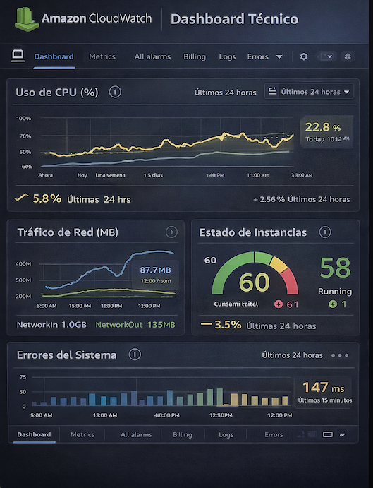
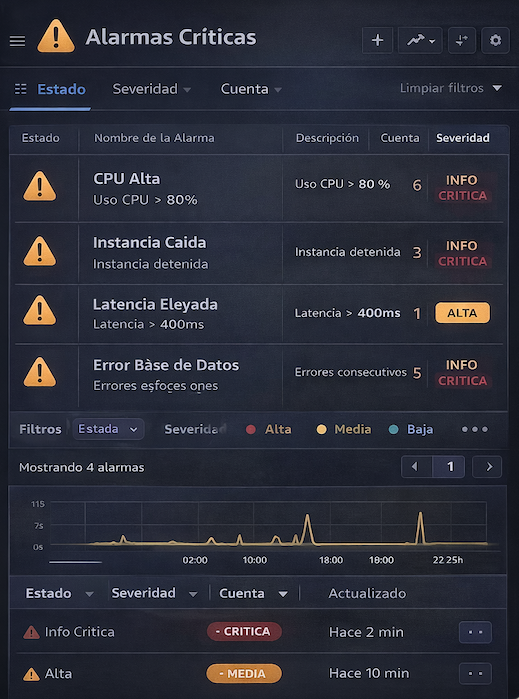

# 🚀 Cloud Migration Architecture Portafolio

Caso real de migración de una plataforma ERP de comercio exterior desde un datacenter local hacia una arquitectura cloud en AWS, liderado desde una perspectiva de **gestión estratégica, continuidad operacional y transformación tecnológica**.

---

## 🎯 Resumen Ejecutivo

La organización operaba sobre un datacenter local con altos costos operativos y riesgos críticos de pérdida de información, impactando directamente la continuidad del negocio.

Se definió y lideró una estrategia de migración cloud escalonada hacia AWS, priorizada por criticidad de clientes, incorporando mejoras en arquitectura, seguridad y operación.

📌 **Resultado:** una plataforma más estable, escalable y preparada para crecimiento e innovación.

---

## 🚨 Impacto del Problema

- Pérdida de información de clientes críticos  
- Multas operativas recurrentes  
- Riesgo de pérdida de clientes VIP  
- Alta dependencia de infraestructura fuera del core del negocio  
- Altos costos de operación (licencias, seguridad, mantenimiento)  
- Necesidad constante de soporte técnico especializado  

---

## 📈 Resultados Esperados

- Reducción de incidentes operativos en ~70%  
- Disponibilidad del servicio > 99.9%  
- Disminución significativa de costos operativos  
- Mayor estabilidad para clientes críticos  
- Base tecnológica para escalabilidad e innovación  

---

## 🧩 Contexto del Negocio

**Industria:** Comercio exterior  
**Plataforma:** ERP logístico (modelo SaaS)  
**Arquitectura:** Instancias independientes por cliente  

### Necesidades del negocio

- Escalar a nuevos mercados  
- Reducir costos operativos  
- Aumentar confiabilidad del servicio  

---

## ⚠️ Problema Estratégico

- Infraestructura fuera del core del negocio  
- Pérdida de información de clientes  
- Multas por incidentes operativos  
- Falta de ambientes controlados  
- Cambios en producción sin gobierno  

---

## 📖 Historia del Proyecto

La organización enfrentaba pérdidas recurrentes de información y altos costos debido a un modelo basado en datacenter local.

Se diseñó y lideró una estrategia de migración cloud progresiva, priorizando clientes según criticidad, asegurando continuidad del negocio durante todo el proceso.

---

## 🏗️ Arquitectura

### 🔹 AS-IS
👉 Ver detalle: `02_arquitectura_actual_as_is.md`

- Datacenter local  
- Máquina virtual por cliente  
- Base de datos independiente  
- Alta fragmentación  
- Problemas de estabilidad  

---

### 🔹 TO-BE
👉 Ver detalle: `03_arquitectura_objetivo_to_be.md`

- Migración a AWS  
- Arquitectura híbrida  
- Segmentación de red (VPC)  
- Bases de datos robustas  
- Estandarización de entornos  

---

## 🖼️ Arquitectura Objetivo

---

## 🔄 Estrategia de Migración

👉 Ver detalle: `migracion.md`

- Migración escalonada  
- Ventanas controladas (01:00 – 06:00 AM y fines de semana)  
- Priorización por criticidad  
- Enfoque en continuidad operacional  

---

## ⚡ Gestión de Riesgos

👉 Ver detalle: `riesgos.md`

- Pérdida de datos → respaldos + validación  
- Impacto operativo → ventanas controladas  
- Clientes críticos → migración individual  
- Comunicación → notificación anticipada  

---

## 📊 Observabilidad y Monitoreo

👉 Ver detalle: `metricas.md`

Se implementa una estrategia de observabilidad basada en Amazon CloudWatch:

### 🔧 Métricas técnicas

- CPUUtilization  
- NetworkIn / NetworkOut  
- DiskReadOps / DiskWriteOps  
- Latencia de aplicación  
- Errores de base de datos  

### 🚨 Alertas críticas

- CPU > 80% sostenido  
- Fallas de instancias  
- Degradación de servicios  

---

## 📊 Dashboards de Monitoreo

### 📌 Dashboard Ejecutivo

Vista orientada a negocio, que permite monitorear el estado general del sistema en tiempo real.

Incluye:

- Disponibilidad del servicio
- Incidentes activos
- Tendencia de fallas
- Estado de salud de la plataforma

Permite a stakeholders tomar decisiones rápidas frente a eventos críticos.

### 🔧 Dashboard Técnico

Vista detallada del comportamiento de la infraestructura y servicios.

Incluye:

- Uso de CPU y memoria
- Tráfico de red
- Latencia de aplicación
- Errores de sistema

Permite al equipo técnico detectar cuellos de botella y degradación del rendimiento.

### 🚨 Dashboard de Alarmas

Consolida eventos críticos detectados automáticamente por el sistema.

Incluye:

- Alertas por uso de CPU elevado
- Fallas de instancias
- Degradación de servicios

Permite activar protocolos de respuesta temprana y reducir impacto en clientes.

## 🔎 Interpretación Operacional

Los dashboards fueron diseñados para soportar la toma de decisiones en distintos niveles:

- Nivel ejecutivo → visión de continuidad del negocio y estado de clientes críticos  
- Nivel técnico → monitoreo de performance y estabilidad  
- Nivel operacional → gestión de incidentes en tiempo real  

Esta estructura permite una gestión integral del servicio en entorno cloud, alineando tecnología con impacto en el negocio.

---

## 👩‍💼 Rol en el Proyecto

**Project Manager Senior / Delivery Lead**

Responsable de:

- Definición de estrategia de migración  
- Coordinación de equipos técnicos  
- Gestión de stakeholders  
- Aseguramiento de continuidad operacional  
- Gestión de riesgos  

---

## 📈 Resultados de Negocio

- Reducción de costos operativos  
- Eliminación de dependencia de datacenter  
- Mejora en estabilidad de plataforma  
- Disminución de incidentes críticos  
- Incorporación de control de costos cloud  

---

## 📂 Documentación del Proyecto

- 📘 Contexto del Negocio  
- 🏗️ Arquitectura AS-IS  
- ☁️ Arquitectura TO-BE  
- 🔄 Estrategia de Migración  
- ⚠️ Gestión de Riesgos  
- 📊 Métricas y Monitoreo  
- 🔐 Seguridad  
- 🗺️ Roadmap  
- 🔍 Antes vs Después  
- 🧠 Lecciones Aprendidas  

---

## 🧠 Enfoque Consultivo

- Alineación negocio-tecnología  
- Gestión de riesgo  
- Decisiones basadas en impacto  
- Estrategia progresiva  

---

## 🚀 Evolución

- CI/CD (conceptual)  
- Observabilidad avanzada  
- Analítica operativa  
- Escalabilidad progresiva

---

## 🔗 Relación con prácticas DevOps

Este proyecto se complementa con prácticas de integración y despliegue continuo (CI/CD), fundamentales en entornos cloud modernos.

📌 Ver implementación práctica en:
👉 https://github.com/vermaldonado-ia/cloud-delivery-pipeline-portafolio

Donde se demuestra:

- Automatización de validaciones (CI)
- Control de calidad (coverage, linting)
- Despliegue continuo (CD)

