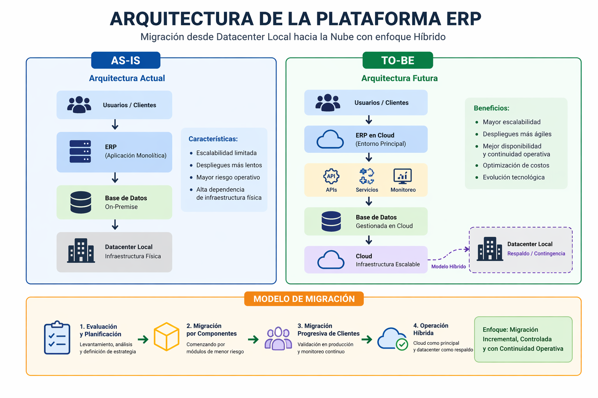

# ☁️ Cloud Migration Architecture Portafolio

Caso real de migración de una plataforma ERP de comercio exterior desde un datacenter local hacia una arquitectura cloud en AWS, liderado desde una perspectiva de gestión, continuidad operacional y alineación estratégica entre negocio y tecnología.

---

## 🚨 Impacto del Problema

* Pérdida de información de clientes críticos
* Multas operativas recurrentes
* Riesgo de pérdida de clientes VIP
* Alta dependencia de infraestructura fuera del core del negocio
* Altos costos asociados a licencias, herramientas de seguridad y mantenimiento del datacenter
* Necesidad de perfiles técnicos especializados para la operación continua

---

## 📈 Resultados Esperados

* Reducción de incidentes operativos en ~70%
* Disponibilidad del servicio > 99.9%
* Disminución significativa de costos operativos
* Mayor estabilidad para clientes críticos

---

## 🎯 Resumen Ejecutivo

La organización operaba sobre un datacenter local con altos costos operativos y riesgos críticos de pérdida de información, impactando directamente la continuidad del negocio.

Se definió y lideró una estrategia de migración cloud escalonada hacia AWS, priorizada por criticidad de clientes, incorporando mejoras en arquitectura, seguridad y operación.

El resultado fue una plataforma más estable, escalable y alineada al crecimiento del negocio, reduciendo riesgos y habilitando expansión internacional.

---

## 🧩 Contexto del Negocio

* **Industria:** Comercio exterior
* **Plataforma:** ERP logístico (modelo SaaS)
* **Arquitectura:** Instancias independientes por cliente

### Necesidades del negocio:

* Escalar a nuevos mercados
* Reducir costos operativos
* Aumentar confiabilidad del servicio

---

## ⚠️ Problema Estratégico

* Infraestructura fuera del core del negocio
* Pérdida de información de clientes
* Multas por incidentes operativos
* Falta de ambientes controlados
* Cambios en producción sin gobierno

---

## 📖 Historia del Proyecto

La organización enfrentaba pérdidas recurrentes de información y altos costos debido a un modelo basado en datacenter local.

Se definió una estrategia de migración cloud progresiva, priorizando clientes según criticidad, asegurando continuidad del negocio durante todo el proceso.

---

## 🏗️ Arquitectura (Visión de Alto Nivel)

### 🔹 AS-IS

👉 Ver detalle completo: [Arquitectura Actual](docs/02_arquitectura_actual_as_is.md)

* Datacenter local
* Máquina virtual por cliente
* Base de datos independiente
* Uso de base de datos de código abierto con problemas de estabilidad
* Alta fragmentación

---

### 🔹 TO-BE

👉 Ver detalle completo: [Arquitectura Objetivo](docs/03_arquitectura_objetivo_to_be.md)

* Migración a AWS
* Arquitectura híbrida
* Segmentación de red (VPC)
* Bases de datos más robustas
* Estandarización

---

## 🖼️ Arquitectura Objetivo

---

## 🔄 Estrategia de Migración

👉 Ver documento completo: [Migración](docs/migracion.md)

* Migración escalonada
* Ventanas controladas (01:00 – 06:00 AM y fines de semana)
* Priorización por criticidad

---

## ⚡ Gestión de Riesgos

👉 Ver detalle: [Riesgos](docs/riesgos.md)

* Pérdida de datos → respaldos + validación
* Impacto operativo → ventanas controladas
* Clientes críticos → migración individual
* Comunicación con clientes → notificación previa

---

## 📊 Observabilidad y Monitoreo

👉 Ver detalle completo: [Métricas y Monitoreo](docs/metricas.md)

* Monitoreo de infraestructura
* Disponibilidad
* Alertas automáticas
* Dashboards

---

## 👩‍💼 Rol en el Proyecto

**Project Manager Senior**

Responsable de:

* Definición de estrategia de migración
* Coordinación de equipos técnicos
* Gestión de stakeholders
* Aseguramiento de continuidad operacional

---

## 📈 Resultados de Negocio

* Reducción significativa de costos operativos
* Eliminación de dependencia de datacenter
* Mejora en estabilidad
* Disminución de incidentes críticos

---

## 📂 Documentación

* 👉 [Contexto](docs/contexto.md)
* 👉 [Arquitectura Actual (AS-IS)](docs/02_arquitectura_actual_as_is.md)
* 👉 [Arquitectura Objetivo (TO-BE)](docs/03_arquitectura_objetivo_to_be.md)
* 👉 [Migración](docs/migracion.md)
* 👉 [Roadmap](docs/roadmap.md)
* 👉 [Riesgos](docs/riesgos.md)
* 👉 [Seguridad](docs/seguridad.md)
* 👉 [Métricas y Monitoreo](docs/metricas.md)
* 👉 [Antes vs Después](docs/antes_despues.md)
* 👉 [Lecciones Aprendidas](docs/lecciones_aprendidas.md)

---

## 🧠 Enfoque Consultivo

* Alineación negocio-tecnología
* Gestión de riesgo
* Decisiones basadas en impacto
* Estrategia progresiva

---

## 🚀 Evolución

* CI/CD (conceptual)
* Observabilidad avanzada
* Analítica operativa
* Escalabilidad progresiva
